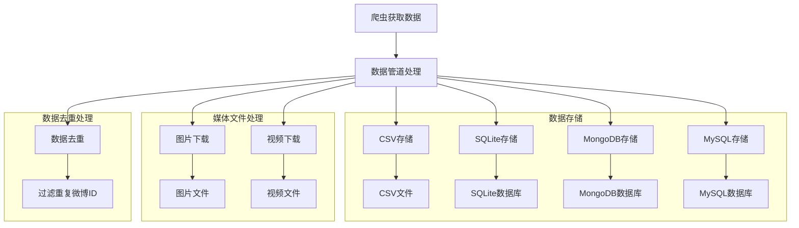
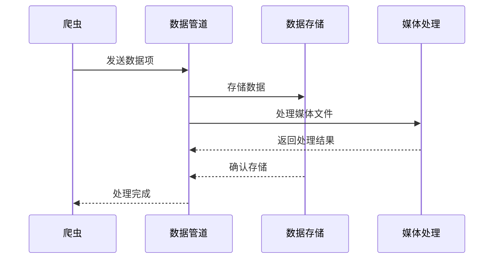

# 微博爬虫项目流程图

## 项目架构图

## 数据处理流程

## 主要功能说明

### 1. 数据存储管道
- **CSV存储**：将数据保存为CSV格式，包含微博ID、用户信息、内容等字段
- **SQLite存储**：使用SQLite数据库存储，支持数据更新和替换
- **MongoDB存储**：使用MongoDB存储，支持文档式数据存储
- **MySQL存储**：使用MySQL数据库，支持结构化数据存储

### 2. 媒体文件处理
- **图片下载**：支持单张和多张图片的下载，自动创建目录结构
- **视频下载**：支持视频文件的下载和存储

### 3. 数据去重
- 使用集合（set）存储已处理的微博ID
- 对重复数据进行过滤，避免重复存储

### 4. 数据字段
主要包含以下字段：
- 微博ID、bid
- 用户信息（ID、昵称、认证信息等）
- 微博内容（正文、话题、@用户等）
- 互动数据（转发、评论、点赞数）
- 媒体信息（图片、视频URL）
- 其他信息（发布时间、来源、IP等）

## 项目特点
1. 支持多种数据存储方式
2. 自动处理媒体文件下载
3. 内置数据去重机制
4. 模块化设计，易于扩展
5. 完善的错误处理机制 